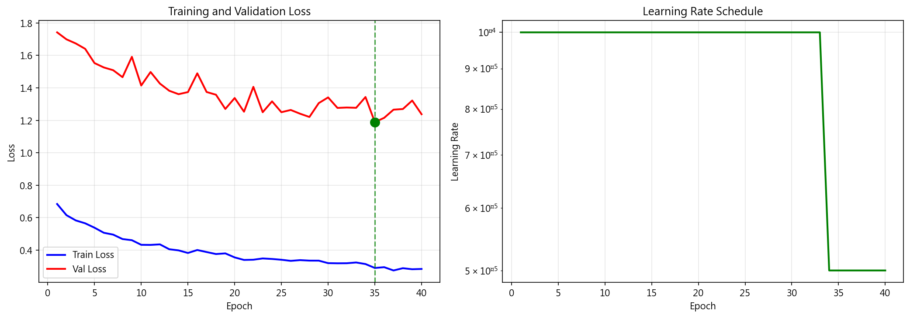
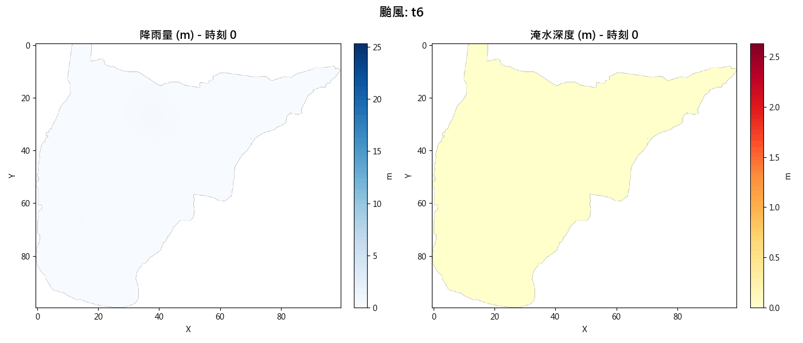
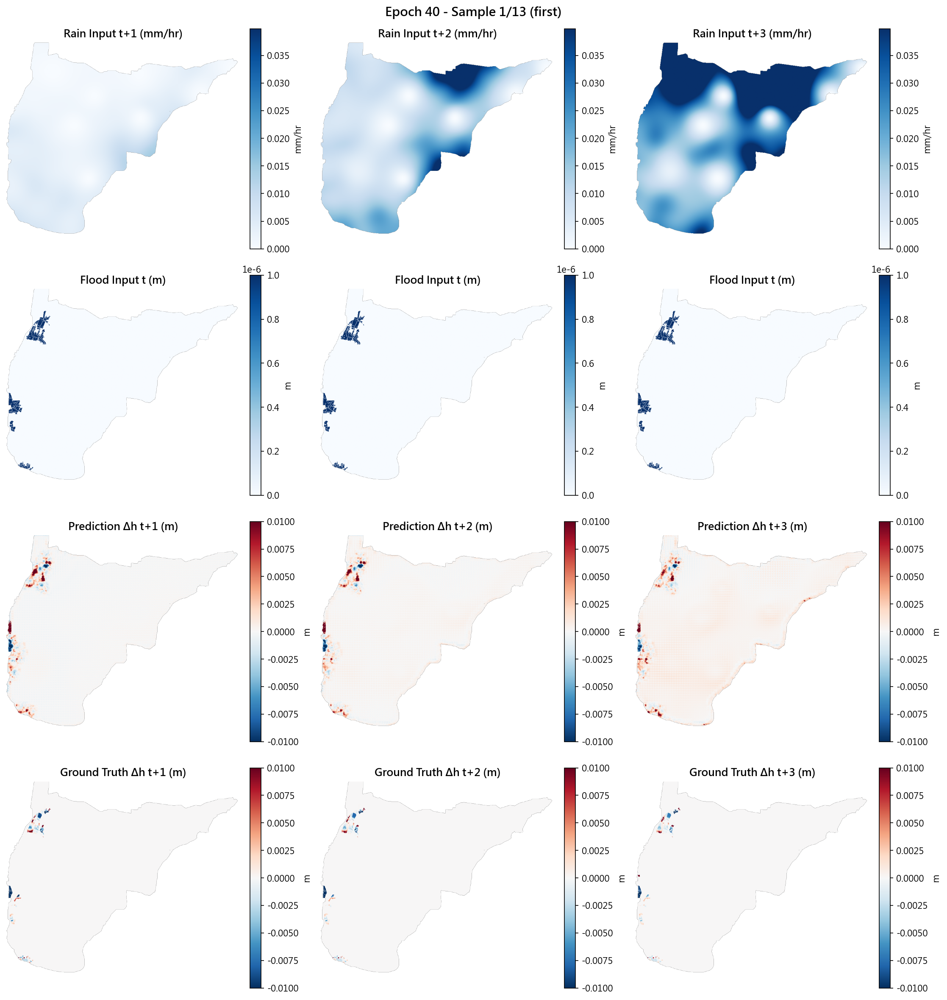

# 淹水預測與視覺化儀表板

基於 ConvLSTM 的颱風淹水深度預測模型，結合互動式 Flask 儀表板，針對雲林縣沿海地區進行鄉鎮級災害風險預警。

---

## 系統架構

```
颱風模擬降雨資料
       ↓
ConvLSTM 模型（HydroNetRainOnly）
  輸入：過去 6 小時 + 未來 3 小時預報降雨（9 張網格）
  輸出：t+1 / t+2 / t+3 小時淹水深度增量
       ↓
Flask 儀表板
  淹水 GeoJSON → H3 六邊形網格（L1/L2/L3 多尺度）
  鄉鎮風險分級（5 級：正常 → 預警 → 危險 → 嚴重 → 極端）
```

---

## 模型：HydroNetRainOnly

### 架構

3 層 ConvLSTM Encoder + Decoder（U-Net 風格）

```
輸入: (batch, 9, 1, 640, 776)   ← 9 時間步 × 降雨網格
  ↓ Encoder Layer 1: Conv(1→16) + ConvLSTM + MaxPool↓2
  ↓ Encoder Layer 2: Conv(16→32) + ConvLSTM + MaxPool↓2
  ↓ Encoder Layer 3: Conv(32→64) + ConvLSTM + MaxPool↓2
     ↓ 保存 t+1, t+2, t+3 的特徵
  ↑ Decoder × 3: ConvTranspose(64→32→16→8→1)
輸出: (batch, 3, 1, 640, 776)   ← 3 時間步 × 淹水增量網格
```

| 參數 | 值 |
|------|----|
| 空間解析度 | 636 × 772（40m / pixel） |
| 輸入時間步 | 9（t-5 到 t+3） |
| 輸出時間步 | 3（t+1, t+2, t+3） |
| 模型參數量 | 435,137 |
| 預測目標 | 淹水深度增量（可正可負，允許水退） |

### 訓練細節

| 設定 | 值 |
|------|----|
| Batch Size | 2（每 batch 約 4.5 GB VRAM） |
| Learning Rate | 1e-4 → 5e-5（排程調降） |
| Epochs | 40 |
| Early Stopping | patience = 10 |
| 損失函數 | 加權 MSE（淹水區域權重 × 100） |
| 每 epoch 訓練時間 | 約 756 秒 |

### 訓練結果

| 指標 | 最佳值 |
| --- | --- |
| Validation Loss | 1.189（Epoch 35） |
| Flood Area MSE | 0.245（Epoch 35） |
| Validation MAE | 0.016 m（Epoch 9） |



### 預測視覺化

去噪過程（真實降雨 → ConvLSTM → 淹水增量預測）：



最終 Epoch 驗證集預測（t+1）：



---

## 儀表板：Flask + Leaflet + H3

針對雲林縣西部沿海 7 個鄉鎮（臺西、口湖、四湖、水林、元長、褒忠、東勢）進行颱風淹水情境展示。

### 功能

- **多時間步切換**：瀏覽 t+1 / t+2 / t+3 的淹水預測結果
- **多尺度視覺化**：
  - L3（原始網格，40m 解析度）
  - L2（H3 Res=8，街區尺度）
  - L1（H3 Res=7，鄉鎮尺度）
- **風險分級標色**：

| 等級 | 水深 | 顏色 |
|------|------|------|
| 極端 | ≥ 3m | 紫紅 |
| 嚴重 | ≥ 1m | 深紅 |
| 危險 | ≥ 0.5m | 紅色 |
| 預警 | ≥ 0.3m | 橙色 |
| 輕微 | ≥ 0.05m | 黃色 |

- **鄉鎮預警面板**：點擊鄉鎮查看 T1/T2/T3 趨勢

---

## 資料說明

| 資料 | 說明 |
|------|------|
| 颱風模擬資料 | `front_test_v2/flood/t5_SW_009{7,8,9}.csv` — 3 個颱風情境的淹水深度網格（770×635，40m 解析度） |
| 訓練資料 | 颱風降雨-淹水對（.gitignore 排除，資料集過大） |
| 模型權重 | `best_model.pth`（.gitignore 排除，5.1MB binary） |

---

## 專案結構

```
flood-simulation-dashboard/
├── model_train/                     # ConvLSTM 模型
│   ├── model.py                     # HydroNetRainOnly 架構
│   ├── train.py                     # 訓練腳本
│   ├── dataset.py                   # 資料載入（含隨機擾動）
│   ├── config.py                    # 超參數設定
│   ├── utils.py                     # 損失函數
│   ├── model_flow_diagram.txt       # 詳細架構圖（ASCII）
│   ├── checkpoints/
│   │   ├── training_curves.png      # 訓練曲線
│   │   └── training_history.json   # 完整訓練記錄
│   └── visualizations/
│       └── demo.gif                 # 預測視覺化動畫
└── front_test_v2/                   # Flask 儀表板
    ├── app.py                       # Flask 主程式
    ├── utils.py                     # 座標轉換 + H3 網格生成
    ├── config.py                    # 儀表板設定（鄉鎮座標等）
    ├── requirements.txt
    ├── flood/                       # 颱風情境淹水 CSV
    ├── static/
    │   ├── main.js                  # 前端地圖邏輯
    │   ├── style.css
    │   └── output/                  # 預計算 GeoJSON（L1/L2/L3）
    └── templates/
        └── index.html
```

---

## 安裝與執行

### 模型訓練

```bash
cd model_train
python -m venv .venv
.venv\Scripts\activate          # Windows
pip install torch torchvision --index-url https://download.pytorch.org/whl/cu118
pip install numpy pandas matplotlib scipy
python train.py
```

> 需要 NVIDIA GPU（建議 8GB+ VRAM）

### 儀表板

```bash
cd front_test_v2
pip install -r requirements.txt

# 1. 重新生成 GeoJSON（若有新的 flood CSV）
python utils.py

# 2. 啟動 Flask
python app.py
# → 開啟 http://localhost:3000
```

---

## Future Work

- 整合中央氣象局即時降雨 API（目前為靜態颱風模擬資料）
- 加入衛星雲圖、地形高程、等高線等多模態特徵
- 延伸預測至 t+6（6 小時預報）
- 部署至雲端（Docker + GCP / Azure）
